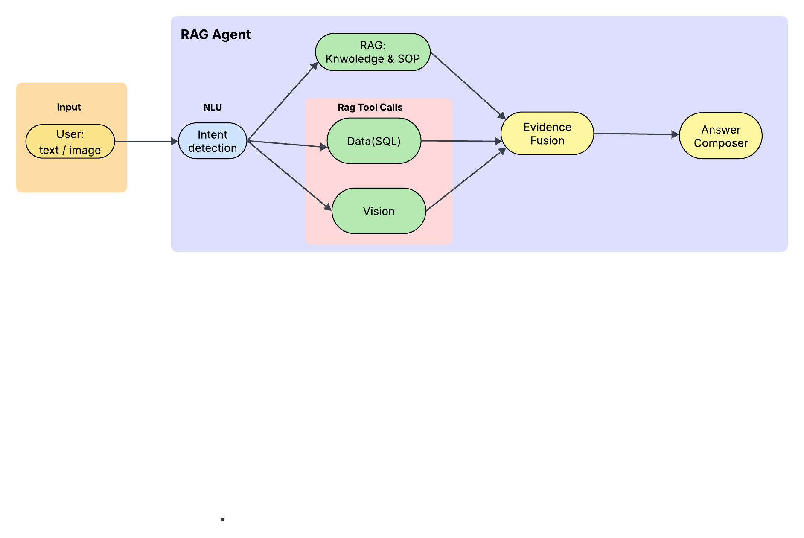

# 🌿 Parks Maintenance Intelligence System

A production-ready intelligent system for Vancouver parks maintenance operations, combining **RAG (Retrieval-Augmented Generation)**, **SQL analytics**, **LLM-enhanced insights**, **VLM image analysis**, and **interactive visualizations**.



---

## ✨ Key Features

- 🤖 **Dual LLM Integration**: Ollama (local) for text summarization + OpenRouter VLM for image analysis
- 📊 **Interactive Visualizations**: Auto-generated charts (line, bar, timeline)
- 🎯 **Semantic Intent Classification**: SentenceTransformer-based few-shot learning
- 🔍 **Multi-Modal Queries**: Text + SQL + Document Retrieval + Image Analysis
- ⚡ **High Performance**: DuckDB for SQL, FAISS for semantic search
- 🏃 **Multi-Domain Support**: Mowing operations + Field standards

---

## 🏗️ System Architecture

```
User Query + Optional Image
        ↓
┌─────────────────────────────┐
│  NLU (Semantic Classifier)  │  ← SentenceTransformer + Few-shot Prototypes
│  - Intent Detection         │
│  - Domain Classification    │
│  - Slot Extraction           │
│  - Template Routing          │
└─────────────────────────────┘
        ↓
┌─────────────────────────────┐
│  Route Plan Builder         │  ← Dynamic keyword selection
│  - Mowing queries → SQL     │
│  - Field queries → RAG      │
│  - Images → VLM + RAG       │
└─────────────────────────────┘
        ↓
┌──────────────────────────────────────────────────┐
│  Executor (Orchestrates tool calls)              │
│                                                  │
│  ┌──────────┐  ┌──────────┐  ┌──────────────┐  │
│  │   RAG    │  │   SQL    │  │  VLM (Cloud) │  │
│  │ FAISS/   │  │ DuckDB   │  │  Claude 3    │  │
│  │  BM25    │  │  +5      │  │  Haiku       │  │
│  │          │  │Templates │  │              │  │
│  └──────────┘  └──────────┘  └──────────────┘  │
│                                                  │
│  ┌──────────────────────────────────────────┐  │
│  │  Local LLM (Ollama - llama3.2:3b)       │  │
│  │  Summarizes RAG content                  │  │
│  └──────────────────────────────────────────┘  │
└──────────────────────────────────────────────────┘
        ↓
┌─────────────────────────────┐
│  Composer                   │
│  - Smart content detection  │
│  - Chart configuration      │
│  - LLM enhancement          │
│  - Markdown formatting      │
└─────────────────────────────┘
        ↓
Frontend (React + Recharts + Modern UI)
```

---

## 🧩 Project Structure

```
capstone_mvp/
│
├── Backend (FastAPI)
│   ├── app.py                  # FastAPI server (/health, /nlu/parse, /agent/answer)
│   ├── nlu.py                  # Semantic intent classification (SentenceTransformer)
│   ├── executor.py             # Tool orchestration engine
│   ├── composer.py             # LLM-enhanced answer generation
│   │
│   ├── Tools/
│   │   ├── rag.py              # FAISS/BM25 retrieval (PDF + TXT support)
│   │   ├── sql_tool.py         # DuckDB templates (5 analytics queries)
│   │   └── cv_tool.py          # OpenRouter VLM integration (Claude 3 Haiku)
│   │
│   ├── config.py               # Configuration and paths
│   ├── .env                    # API keys (not in git)
│   ├── .env.example            # Template for API keys
│   │
│   └── data/
│       ├── 6 Mowing Reports to Jun 20 2025.xlsx
│       ├── rag_docs/
│       │   ├── mowing_standard.pdf
│       │   └── field_standards.txt      # Sports field dimensions
│       └── faiss_index/                 # Auto-generated vector index
│
├── Frontend (React + Vite)
│   └── parks-ui/
│       ├── src/
│       │   ├── App.jsx                  # Main UI with category-based presets
│       │   ├── App.css                  # Modern gradient design
│       │   └── main.jsx
│       ├── package.json
│       └── vite.config.js
│
└── Data Preparation
    └── data_prep/
        └── convert_field_standards.py   # CSV to RAG document converter
```

---

## 📊 Supported Query Types

### 1. 💰 **Mowing Cost Analysis** (RAG + SQL)

**Capabilities**:
- Identify highest-cost parks by month
- Trend analysis across time periods
- Park-to-park comparisons
- Last activity tracking
- Cost breakdown by activity type

**Examples**:
```
"Which park had the highest mowing cost in March 2025?"
"Show mowing cost trend from January to June 2025"
"Compare mowing costs across all parks in March 2025"
"When was the last mowing at Cambridge Park?"
```

**System Response**:
- 📊 Interactive charts (line/bar/timeline)
- 📈 SQL query results
- 📚 LLM-summarized context from standards
- 🔗 Source citations

**SQL Templates**:
- `mowing.labor_cost_month_top1` - Top park by cost
- `mowing.cost_trend` - Monthly trends
- `mowing.cost_by_park_month` - Park comparisons
- `mowing.last_mowing_date` - Activity tracking
- `mowing.cost_breakdown` - Detailed analysis

---

### 2. 📋 **Standards & Procedures** (Pure RAG)

**Capabilities**:
- Mowing SOPs and safety requirements
- Sports field dimensions (all age groups)
- Baseball/Softball pitching distances
- Equipment specifications

**Examples**:
```
"What are the mowing steps and safety requirements?"
"What are the dimensions for U15 soccer?"
"Show me baseball field requirements for U13"
"What's the pitching distance for female softball U17?"
```

**System Response**:
- 📖 Structured information (steps, dimensions, requirements)
- 🤖 Ollama-enhanced summaries
- 📚 Source citations from PDF/TXT documents

**Supported Sports**:
- Soccer (U5-U18, 11v11)
- Baseball (U7-U18)
- Softball (Male/Female, U7-Masters)
- Cricket, Football (CFL/NFL), Rugby, Lacrosse, Ultimate Frisbee

---

### 3. 🖼️ **Image Analysis** (VLM + RAG)

**Capabilities**:
- Field condition assessment (1-10 rating)
- Turf health evaluation
- Maintenance needs detection
- Safety hazard identification
- AI-powered recommendations

**Examples**:
```
Upload image + "Assess this field condition"
Upload image + "Does this field need mowing?"
Upload image + "Is this field suitable for U15 soccer?"
```

**System Response**:
- 🎯 Condition score and label
- 🔍 Detected issues
- 💡 Maintenance recommendations
- 📚 RAG context from relevant standards
- ⚡ Powered by Claude 3 Haiku (via OpenRouter)

---

## 🚀 Quick Start

### Prerequisites
- Python 3.11+
- Node.js 18+
- Ollama (for local LLM)
- OpenRouter API key (for VLM, free tier available)

### 1️⃣ Install Ollama (Local LLM)

```bash
# macOS
brew install ollama

# Start Ollama app
open -a Ollama

# Download model
ollama pull llama3.2:3b
```

### 2️⃣ Setup Backend

```bash
# Create environment
conda create -n capstone python=3.11
conda activate capstone

# Install dependencies
pip install -r requirements.txt

# Configure API keys
cp .env.example .env
# Edit .env and add your OPENROUTER_API_KEY

# Start server
uvicorn app:app --reload --host 127.0.0.1 --port 8000
```

**Backend runs at**: http://127.0.0.1:8000

### 3️⃣ Setup Frontend

```bash
cd parks-ui
npm install
npm run dev
```

**Frontend runs at**: http://localhost:5173

---

## 🔌 API Endpoints

| Method | Endpoint | Description | Request Body |
|--------|----------|-------------|--------------|
| GET | `/health` | System status, RAG mode, uptime | - |
| POST | `/nlu/parse` | Intent classification, slot extraction | `{"text": "...", "image_uri": "..."}` |
| POST | `/agent/answer` | Complete RAG+SQL+VLM pipeline | `{"text": "...", "image_uri": "..."}` |

### Example Response Structure

```json
{
  "answer_md": "### Results\n\n**Cambridge Park** had the highest cost...",
  "tables": [{
    "name": "Top Park by Mowing Cost (3/2025)",
    "columns": ["park", "total_cost"],
    "rows": [...]
  }],
  "charts": [{
    "type": "bar",
    "title": "Mowing Cost by Park",
    "series": [...]
  }],
  "citations": [{
    "title": "Reference Document",
    "source": "mowing_standard.pdf#p12"
  }],
  "logs": [...]
}
```

---

## 🧠 NLU Intent Classification

Uses **SentenceTransformer** (all-MiniLM-L6-v2) with few-shot prototypes:

| Intent | Triggers | Tools | Output |
|--------|----------|-------|--------|
| `RAG+SQL_tool` | Cost queries + "highest/top" | kb_retrieve → sql_query_rag → LLM | Answer + Chart + Table |
| `SQL_tool` | Trend/compare/breakdown | sql_query_rag → chart config | Chart + Table |
| `RAG` | "dimensions/requirements/steps" | kb_retrieve → LLM summary | Formatted text |
| `RAG+CV_tool` | Image + query | kb_retrieve → VLM analysis | Assessment + Context |
| `CV_tool` | Image only | VLM analysis | Visual assessment |

**Smart Features**:
- Automatic domain detection (mowing vs field_standards)
- Dynamic keyword selection based on query content
- Triple-layer CV intent verification (no CV without image)

---

## 📈 SQL Analytics Templates

| Template | Purpose | Parameters | Chart Type |
|----------|---------|------------|------------|
| `mowing.labor_cost_month_top1` | Find highest-cost park | month, year | Bar |
| `mowing.cost_trend` | Monthly trend analysis | start_month, end_month, year, park? | Line (top 10) |
| `mowing.cost_by_park_month` | Compare all parks | month, year | Bar |
| `mowing.last_mowing_date` | Track last activity | park_name? | Timeline |
| `mowing.cost_breakdown` | Activity-level detail | park?, month?, year | Table |

---

## 🤖 LLM Integration

### Local LLM (Ollama) - Text Summarization
- **Model**: llama3.2:3b (2GB, runs locally)
- **Purpose**: Enhance RAG document snippets
- **Cost**: FREE
- **Setup**: `ollama pull llama3.2:3b`

**What it does**:
- Transforms technical PDF/TXT content into clear summaries
- Provides context for SQL results
- Explains standards in plain language

### Cloud VLM (OpenRouter) - Image Analysis
- **Model**: Claude 3 Haiku (Anthropic)
- **Purpose**: Sports field image assessment
- **Cost**: $0.25 / 1M tokens (~$0.0002/image)
- **Setup**: API key in `.env` file

**What it does**:
- Assesses field condition (1-10 score)
- Detects maintenance needs
- Identifies issues and hazards
- Generates actionable recommendations

**Fallback**: If API key not configured, shows helpful setup instructions

---

## 📊 Chart Visualization

Auto-generated based on query type:

| Chart Type | Used For | Features |
|------------|----------|----------|
| 📈 Line Chart | Cost trends | Multi-series, top 10 parks, interactive tooltips |
| 📊 Bar Chart | Park comparisons | Sorted by value, rounded corners |
| 📊 Stacked Bar | Activity breakdown | Color-coded by type |
| 📅 Timeline | Last activity dates | Chronological, with badges |

**Library**: Recharts (React)
**Rendering**: Client-side (interactive, responsive)

---

## 🔧 Configuration

### Environment Variables (.env)

```bash
# Required for VLM image analysis
OPENROUTER_API_KEY=sk-or-v1-your-key-here

# Optional overrides
# DATA_DIR=/custom/path/to/data
# OLLAMA_MODEL=llama3.2:1b
```

### Data Paths (config.py)

```python
DATA_DIR = "data"
RAG_DOC_DIR = "data/rag_docs"        # PDF and TXT files
FAISS_DIR = "data/faiss_index"       # Vector store
LABOR_XLSX = "data/6 Mowing Reports to Jun 20 2025.xlsx"
```

---

## 🧪 Example Queries by Category

### 💰 Cost Analysis

| Query | Returns |
|-------|---------|
| "Which park had the highest mowing cost in March 2025?" | Top park, cost, bar chart |
| "Show mowing cost trend from January to June 2025" | Line chart (top 10 parks), table |
| "Compare mowing costs across all parks in March 2025" | Bar chart, ranked table |
| "When was the last mowing at Cambridge Park?" | Timeline, date, session count |

### 📋 Standards & Procedures

| Query | Returns |
|-------|---------|
| "What are the mowing steps and safety requirements?" | Structured SOP, materials, tools, safety |
| "What are the dimensions for U15 soccer?" | Field dimensions, age suitability |
| "Show me baseball field requirements for U13" | Pitching distance, base paths, fence range |
| "What's the pitching distance for female softball U17?" | Specific measurement, compliance range |

### 🖼️ Image Analysis (with uploaded image)

| Query | Returns |
|-------|---------|
| "Assess this field condition" | Score, issues, recommendations, RAG context |
| "Does this field need mowing?" | Yes/no, grass height estimate, priority |
| "Is this field suitable for U15 soccer?" | Suitability assessment, dimension analysis |

---

## 📦 Dependencies

### Backend
```
# Core
fastapi>=0.111          # Web framework
uvicorn[standard]>=0.30 # ASGI server
pydantic>=2.7           # Data validation

# Data & Analytics
pandas==2.2.0           # Data processing
numpy==1.26.4           # Numerical computing
duckdb>=0.10.0          # In-process SQL database
openpyxl>=3.1.0         # Excel file support

# RAG & NLP
langchain>=0.1.0        # RAG framework
faiss-cpu>=1.7.4        # Vector similarity search
sentence-transformers>=2.2.0  # Semantic embeddings
pypdf>=3.17.0           # PDF parsing

# LLM Integration
openai>=1.12.0          # Client for Ollama + OpenRouter
python-dotenv>=1.0.0    # Environment variable management
```

### Frontend
```json
{
  "react": "^19.1.1",
  "recharts": "^2.13.3",   // Chart library
  "vite": "^7.1.7"         // Build tool
}
```

---

## 🔒 Security & Privacy

- ✅ All SQL processing is local (DuckDB in-process)
- ✅ Text summarization is local (Ollama)
- ✅ API keys stored in `.env` (not in git)
- ⚠️ Image analysis uses cloud API (OpenRouter)
- ✅ Images are not stored, only analyzed in real-time

---

## 📈 Performance Metrics

| Component | Avg Response Time | Notes |
|-----------|-------------------|-------|
| NLU Classification | ~50ms | SentenceTransformer inference |
| SQL Query | 5-20ms | DuckDB in-memory |
| RAG Retrieval | 10-30ms | FAISS vector search |
| Ollama Summary | 500ms-2s | llama3.2:3b on M1 Mac |
| VLM Analysis | 1-3s | Claude 3 Haiku via API |
| **Total E2E** | **1-5s** | Varies by query complexity |

---

## 🎯 Use Cases

### 1. Budget Planning & Reporting
- Identify high-cost parks
- Analyze seasonal trends
- Compare contractor performance
- Generate cost reports with charts

### 2. Operational Compliance
- Access mowing SOPs instantly
- Check field dimension standards
- Verify age group requirements
- Ensure safety compliance

### 3. Field Management
- Assess field conditions via photos
- Determine maintenance priorities
- Plan scheduling based on last activity
- Validate field suitability for events

### 4. Data-Driven Decisions
- Combine cost data with standards
- Justify budget allocations
- Optimize maintenance schedules
- Track performance over time

---

## 🛠️ Development Guide

### Adding New SQL Templates

1. **Define function** in `sql_tool.py`:
```python
def _tpl_your_template(con, params):
    sql = "SELECT ..."
    return {"rows": rows, "rowcount": len(rows), "elapsed_ms": ...}
```

2. **Register template**:
```python
TEMPLATE_REGISTRY["mowing.your_template"] = _tpl_your_template
```

3. **Add NLU routing** in `nlu.py`:
```python
if "your_keyword" in query:
    template_hint = "mowing.your_template"
```

4. **Add prototype examples**:
```python
INTENT_PROTOTYPES["SQL_tool"].append("Your example query")
```

### Adding New RAG Documents

1. **Add PDF or TXT** to `data/rag_docs/`
2. **Delete old index**: `rm -rf data/faiss_index/*`
3. **Restart backend** - FAISS rebuilds automatically

### Customizing VLM Prompts

Edit `cv_tool.py` → `assess_field_condition_vlm()` → `base_prompt`

---

## 🎨 UI Customization

### Theming

Edit `App.css` variables:
```css
:root {
  --bg: linear-gradient(135deg, #667eea 0%, #764ba2 100%);
  --card: #ffffff;
  --blue: #3b82f6;
  /* ... */
}
```

### Adding Query Presets

Edit `App.jsx` → `presetCategories`:
```javascript
{
  category: "🆕 Your Category",
  queries: ["Your query 1", "Your query 2"]
}
```

---

## 🐛 Troubleshooting

### Ollama Not Responding
```bash
# Check status
curl http://localhost:11434/api/tags

# Restart
open -a Ollama
```

### VLM Returns Mock Data
```bash
# Check API key
echo $OPENROUTER_API_KEY

# Set if missing
export OPENROUTER_API_KEY="sk-or-v1-..."
```

### Field Dimensions Not Found
```bash
# Check file exists
ls data/rag_docs/field_standards.txt

# Rebuild index
rm -rf data/faiss_index/*
# Restart backend
```

### Wrong Document Retrieved
```bash
# Check backend logs for:
[NLU] Detected FIELD DIMENSIONS query
[NLU] Detected MOWING PROCEDURES query

# Check RAG keyword selection in nlu.py
```

---

## 💰 Cost Analysis

### Monthly Costs (100 users, 1000 queries/month)

| Component | Cost | Notes |
|-----------|------|-------|
| Ollama (local) | $0 | Free, runs on your hardware |
| VLM (Claude Haiku) | ~$0.20 | Assuming 100 images @ $0.002 each |
| OpenRouter Free Tier | $0 | Free credits available |
| **Total** | **< $1/month** | Extremely cost-effective |

---

## 🚧 Roadmap

### ✅ Completed (v1.0)
- [x] Multi-domain RAG (mowing + field standards)
- [x] 5 SQL analytics templates
- [x] Interactive chart generation
- [x] Ollama LLM integration
- [x] Claude 3 Haiku VLM integration
- [x] Modern responsive UI

### 🔄 In Progress
- [ ] Field dimension validation from images
- [ ] Maintenance scheduling automation
- [ ] Advanced safety hazard detection
- [ ] Multi-language support

### 🎯 Future Enhancements
- [ ] Real-time satellite imagery integration
- [ ] Automated field measurement from aerial photos
- [ ] Contractor performance scoring
- [ ] Mobile app (React Native)
- [ ] Export reports (PDF/Excel)
- [ ] User authentication

---

## 👥 Team

- **Project**: Northeastern University Capstone

---

## 📄 License

This project is developed as part of a capstone project at Northeastern University in collaboration with Vancouver Parks Board.

---

## 🙏 Acknowledgments

- **LangChain** - RAG framework
- **Ollama** - Local LLM inference
- **OpenRouter** - VLM API aggregation
- **Anthropic** - Claude 3 Haiku model
- **Recharts** - Data visualization
- **FastAPI** - Backend framework
- **Vancouver Parks Board** - Domain expertise and data

---

## 📞 Support

For questions or issues:
1. Check troubleshooting section above
2. Review backend logs: `uvicorn app:app --reload`
3. Verify configuration: `.env` file and `config.py`

**System Health Check**: Visit http://127.0.0.1:8000/health